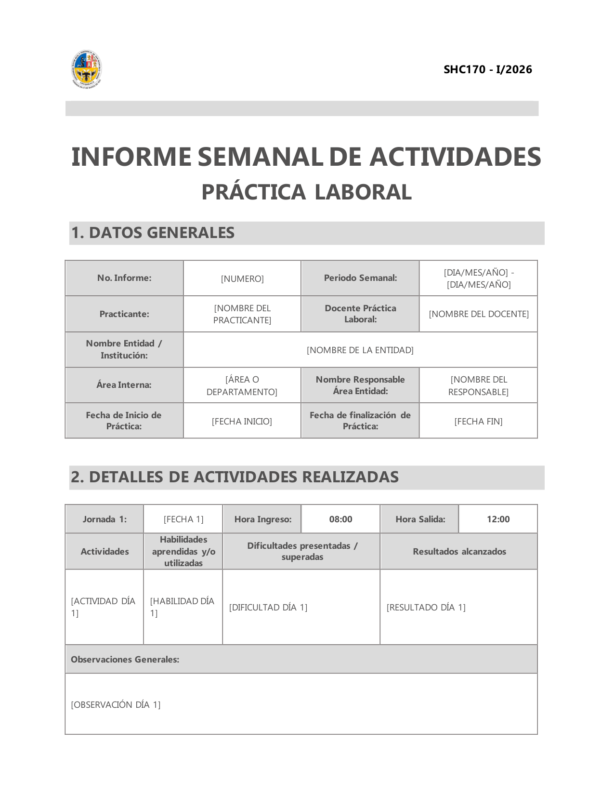

# 🎓 Generador de Informes de Práctica Laboral - USFX

<p align="center">
  
  &nbsp;&nbsp;&nbsp;&nbsp;
  
</p>

Script en Python para automatizar la generación de informes semanales de práctica laboral en Word (`.docx`). Optimizado para la materia de **Práctica Laboral (SHC170)** (Ingeniería de Sistemas, USFX) y adaptable a otras instituciones.

**Autor:** [@eld4vd](https://github.com/eld4vd)

---

## 🚀 Características Principales

- **Maquetado Automático:** Configura párrafos, fuentes (Ebrima), bordes y colores según la plantilla.
- **Gestión por Jornadas:** Documenta las actividades, habilidades, dificultades y resultados diarios.
- **Logo Dinámico:** Inserta automáticamente tu logotipo institucional en el documento.
- **Formato Output:** Genera un `.docx` listo para la revisión final y exportación a PDF.

---

## 📂 Estructura del Proyecto

* `script-template.py`: Script principal donde configuras tus datos personales y actividades.
* `datos.txt`: Guía con ejemplos aprobados para redactar cada campo de tu informe diario.
* `README.md`: Documentación del repositorio.
* `logo.png`: Imagen del logo institucional que debe importarse localmente.
* `images/`: Recursos visuales del Readme.

---

## 🛠️ Requisitos Previos

Requiere **Python 3.x**. Debes instalar la siguiente dependencia:

```bash
pip install python-docx
```

---

## 📝 Modo de Uso

1. Clona el repositorio a tu máquina.
2. Coloca un archivo válido con el nombre `logo.png` en la misma raíz de la carpeta.
3. Abre el archivo `script-template.py` y ve al apartado **`# DATOS A COMPLETAR`** (Línea ~22).
4. Llena tus datos personales y la variable `JORNADAS` para cada día de la semana.
5. Ejecuta el script:

```bash
python script-template.py
```

6. Se generará un documento `Informe_Semanal_X.docx`. Ábrelo para verificar y expórtalo a PDF.

---

## 💡 Consejos de Redacción (`datos.txt`)

Sigue las reglas de este archivo para asegurar tu aprobación:

* **Actividades:** Inicia la frase con un sustantivo o un verbo en infinitivo (*ej. "Configuración de equipo router"*).
* **Habilidades:** Cita normativas o herramientas informáticas concretas (*ej. "Cableado IEEE 802.3", "React.js"*).
* **Dificultades:** Describe el fallo técnico. Si no lo hubo, simplemente pon *"Ninguna"*.
* **Resultados:** Trata de mostrar métricas cuantificables (*ej. "Instalación de 8 puertos funcionales"*).

### 🤖 Tip Extra: Automatiza tu redacción con IA
Para acelerar el proceso, envía tus anotaciones borrador y el contenido completo de `datos.txt` (como normas de contexto) al chat de una Inteligencia Artificial (ChatGPT, GitHub Copilot, Claude). Dile que formatee tu semana en el arreglo de Python propuesto. Te ahorrarás aún más tiempo.

---
*Desarrollado por **[@eld4vd](https://github.com/eld4vd)**.*
